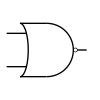
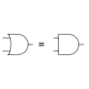
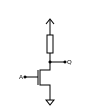

== Boolean Algebra and Basic Logic Gates

We are starting (the journey) with three very 
basic logic functions (or operations), which despite their simplicity 
already are valid instructions of a regular CPU:

*NOT, AND and OR*

Logical functions - also called operations, the author will use both terms interchangebly here -
can be described in various ways, most often it is described implicit
as boolean equation, but it can also be explained explicit in a truth table.

A truth table is a table with the a column for every input and a column for every output.
So it shows the output respective the outputs of the function for all possible combinations of inputs. 
Also they can contain columns with intermediate values.

The truth tables shown in this lesson are in general very small and show only combinations of two inputs,
although all the functions joining inputs can be expanded to a arbitrary number of inputs.

Boolean equations can be transformed to truth tables and vice versa. Later, we will also introduce 
https://en.wikipedia.org/wiki/Karnaugh_map[Karnaugh maps], a way to optimize boolean logic in a graphical way.

=== NOT 
The not operation also termed as inversion,
is denoted as \[\overline{A} = \neg A = Q\]

[width="50%" cols="1,1"]
|==========
| A   | Q    
| 0   | 1    
| 1   | 0    
|==========

image:../images/how_does_cpu/inverter_symbol.svg[width=200]

The not operation is the only one with only one input, it can not be expanded.

Accordingly the gate-level implementation is also known by the name inverter.
Despite its seemingly simple functionality there is a lot to say about the inverter 
for both the logical as well the implementation, so the author will dedicate it an own 
post in the mid-feature.

=== AND

The and  operation  also termed as conjunction 
is denoted as \[A \land B = Q\]

[width="50%" cols="1,1,1"]
|================
| A   | B   |  Q  
| 0   | 0   |  0  
| 0   | 1   |  0  
| 1   | 0   |  0  
| 1   | 1   |  1  
|================

image:../images/how_does_cpu/and_symbol.svg[width=200]

=== OR 

The or operation also termed as disjunction 
is denoted as \[A \lor B = Q\]

[width="50%" cols="1,1,1"]
|================
| A   | B   |  Q  
| 0   | 0   |  0  
| 0   | 1   |  1 
| 1   | 0   |  1  
| 1   | 1   |  1  
|================
  
image:../images/how_does_cpu/or_symbol.svg[width=200]

////
=== XOR 

The exclusive-or operation xor which is also termed as antivalence
is denoted as A ⊕ B = Q

[width="50%"]
|================
| A   | B   |  Q  
| 0   | 0   |  0  
| 0   | 1   |  1 
| 1   | 0   |  1  
| 1   | 1   |  0  
|================
  
image:../images/how_does_cpu/xor_symbol.svg[width=200]

There are a lot of important applications for the exclusive-or operation
as you can expect for a such basic and fundamaental operation, but still
the situation is a bit different with this operation compared to 'and' and 'or'.

////

'''

Although boolean algebra on itself is an interesting field, we will only skim the subject briefly here, just enough
to get a feeling and understanding how to work with boolean formulas.

[NOTE]
If you are interested in a more profound view, providing induction and proof, 
I refer you to accordingly literature (sources listed at the end).

The laws of the boolean algebra are shown in the following table:
[%autowidth cols="40,75a,75a",options="header"]
|====================================================================================================================
|   Law   |  ∧  (conjunction, AND operator)               |  ∨ (disjunction, OR operator)
| commutative law   | \[p \land q = q \land p\]   |\[p \lor q = q \lor p\]
| associative law   | 
\[p \land (q \land r) = (p \land q) \land r = pqr\]  |\[p \lor (q \lor r) = (p \lor q) \lor r = p \lor q \lor r\]
| absorptions law   | \[p \land (p \lor q) = p\]| \[p \lor (p \land q) = p\]
| distributive law  | \[p \lor (q \lor r) = (p \land q) \lor (p \land r) = pq \lor pr\] |
\[p \lor (q \lor r) = (p \lor q) \lor (p \lor r) = (p \lor q)(p \lor r)\]
| neutral elements  | \[p \land 1 = p\] | \[p \lor 0 = p\]                                                   
| complem. element  |  \[p \land \neg p = 0\] | \[p \lor \neg p = 1\] | 
*Reference* | 
*Hans-Jochen Bartsch* | 
*Taschenbuch Mathematischer Formeln, 20. Auflage, p. 27- 28*  |
|====================================================================================================================

You probably know intuitively - or from school-  the first two laws mentioned in the table, 
the commutative law and the associative laws.
As you can see, every law can be applied to conjunctions as well as disjunctions without any exceptions.

The commutative law implies that the order of the variables is neutral for the operation and can be swapped without
changing the result of the operation. 

The associative law implies, that parenthesis are swappable. Conjunctions can be condensed without operator.

The absorptions law is probably not known to you from school, as it is only used in logic and has no counterpart in at least
school mathmatics.

The distributive law, again, is known from school. It implies that variables / operations outside of paranthesis needs 
to be applied to all variables in the parenthesis.

The law of neutral elements, again is something special to boolean algebra. The logic one is the correspondent to 'true',
and so p and true equals 'true', so as the logic zero is 'false' and so p or false equals p.

The complementary law implies, that to every element (variable) p there is a complementary element (variable) [overline]#p#,
so that the conjunction results in a  logical zero while disjunction results in a logical one.

'''

At this point the author has to leap ahead a bit as some practical issues on the electrical level need some thought on their
logic level:
On the implementation level (for an electrical implementation) it is rather uncommon to use AND,OR and NOT directly, instead 
the inverse functions NAND and NOR are used.

=== NAND and NOR

The NAND operation is denoted as \[\overline{A \land B} = Q\]
while the NOR operation is denoted as \[\overline{A \lor B} = Q\]

[width="100%" cols="a,a"]
|======
| NAND | NOR
| |
|======

As you can see, for those two functions the results are exactly the inverse of their respective complement 
(NAND <==> AND,NOR <==> OR), in that sense the author recommends the construction of the respective truth tables 
as an exercise to the reader.

== The De Morgan theorem

In addition to those merely basic axioms introduced above, there is the **De Morgan theorem**,
which we need to easily convert between NAND and NOR. For the sake of simplicity we only show for 
two elements however the theorem is independent from any number of elements / inputs.

["latex", "../images/demorgan_nand.svg",imgfmt="svg", width="75%"] 
\[\overline{p_1 \land p_2} = \overline{p_1} \lor \overline{p_2}\]

[width="100%" cols="a,a,25a,25a,25a,25a"]
|==========================================================================================
| A   | B   |\[\overline{A}\] | \[\overline{B}\] | \[\overline{AB}\]  |\[\overline{A} \lor \overline{B}\]
| 0   | 0   |    1         |     1         |          1       | 1
| 0   | 1   |    1         |     0         |          1       | 1
| 1   | 0   |    0         |     1         |          1       | 1
| 1   | 1   |    0         |     0         |          0       | 0
|==========================================================================================

image:../images/how_does_cpu/de_morgan_nand_equivalence.svg[width=400]

["latex", "../images/demorgan_nor.svg",imgfmt="svg", width="75%"] 
\[\overline{p_1 \lor p_2} = \overline{p_1} \land \overline{p_2}\]

[width="75%" cols="a,a,25a,25a,25a,25a"]
|==========================================================================================
| A   | B   |\[\overline{A}\] | \[\overline{B}\] |  \[\overline{AB}\]| \[\overline{A} \lor \overline{B}\]
| 0   | 0   |    1         |     1         |          1       | 1
| 0   | 1   |    1         |     0         |          0       | 0
| 1   | 0   |    0         |     1         |          0       | 0
| 1   | 1   |    0         |     0         |          0       | 0
|==========================================================================================

Now we are finally equipped to continue with the electrical part / description.

== Implementation on electrical level

First we are introducing some common electronic components and their symbols used in 
electric circuit schematics.

image:../images/how_does_cpu/common_symbols.svg[width=500]

=== The diode

We are beginning the journey with a simplificated circuit design for 'and' and 'or' called wired logic.
This circuit design is so simple it is even not possible to implement an inverter in it.

[width="100%" cols="100a,100a"]
|======
| wired and | wired or
|image:../images/how_does_cpu/wire_and.svg[width=250] | image:../images/how_does_cpu/wire_or.svg[width=250] 
| # diodes: 2 | # diodes : 2
|======

As you can see, this circuit is not to complicate - even laymans in electronc should be able to identify the essential parts
of - the inputs are connected to a diode, each. A diode is a simple semiconductor which acts as a one-way for electric current.
Semiconductors are a group of materials (only silicon and germanium are useful here, due to their chemical properties),
not really conductor but also no insulator. In fact the conductiviy of the material is dependent on the deliberated pollution 
of their crystall lattice structure with elements of the fifth main group, for an n(egative)-dotted material respectively of the third main group
for a p(ositive) dotted material. This process is called dotting. For the interested reader https://www.electrical4u.com/semiconductor-physics/[here]
is a link to all the physical background the author was to lazy to repeat since it is often and better explained on the internet already ;-) .

image:../images/how_does_cpu/diode_structure.svg[width=450] 

All we need to know right know is that a diode consist of one substrate (in most cases today silicon) which becomes n-dotted on one side and p-dotted on the other, 
forming a pn-junction in between acting as said one-way barrier: It is possible for electrons to rush from n-side to the p-side but not the other way round. 

The second component of the circuits shown above is a resistor, its solely purpose is to reduce the current flowing. 
For wire-and it is wired as pull-up resistor while for wire-or it is wired as pull down resistor.
The wire-and only reaches a sufficient high-level if all inputs go high-level. Similar the wire-or only goes low-level if neither of the inputs
goes high level.To prevent current flowing from pull-up resistor to the output of the previous circuit (wire and) respectively current flowing 
from one input back to the other input (wire-or), the diodes are in place.

A problem of this setup which we will definitely encounter at some point, is that the signal is weakend when flowing from input to the output 
and there is no ability  provided to recover the signal, so at the output the signal level might not be distinguished correctly by the subsequent circuit. 
Allow the author a remark in a subtle detail in the terminology at this point: Although it is often described as amplifying we want holding on here, that we want a 
somewhat 'intelligent' signal amplifier here recognizing the signal level of the input signal and recovering, complementary to a 'stupid' amplifier just
amp-ing the input signal.

So the diodes are a fine component, e.g. useful when protecting parts of the circuit from electrostatic discharge 
(https://www.allaboutcircuits.com/textbook/semiconductors/chpt-9/electrostatic-discharge/[ESD]), but for our logic it is not sufficient.

What if we had a component capable to amplify the signal, so we could design circuits also recovering the signal levels with it?
Luckily such a component exists and is introduced in the next section.

////
//=== The classical transistor
//
//Before we actually introduce the transistor let us do a peek into history. Some of the first computers built were using 
//http://www.historicsimulations.com/ZuseZ3.html[electromechanical relays], 
//whereas others relied on https://www.thoughtco.com/history-of-the-eniac-computer-1991601[vacuum tubes]. 
//The very first one(s) were purely https://www.fourmilab.ch/babbage/[mechanical].
//Here we want to focus on the vacuum tubes - in particular the triode -as black boxes as on the outside the working principal is roughly comparable to that 
//of a standard / classic bipolar transitor.
//
//[width="100%" cols="a,a"]
//|======
//|Bipolar Junction Transistor (BJT) | Triode (certain type of vacuum tube)
//||image:../images/how_does_cpu/bjt_structure.svg[width=450] | image:../images/how_does_cpu/triode.svg[width=300]
//| *>* A current on basis controls the current between collector and emitter     
//| *>* A voltage on grid controls the current between collector and emitter 
//|======
////

////
A transistor allows the implementation of the operations introduced above and at one go also allows allows the amplifying of the signal.
It is a switching element which can be controlled with a control voltage, similar to an electromechanical relay,
where a small current in a coil builds up a magnetic field which moves the armature to close (or open, depending on the construction) 
the contacts of the load circuit.
////

=== The MOSFET transistor

The type of transistor we want to introduce and use here is a MOSFET (Metal Oxid Semiconductor Field Effect Transistor) - as opposed to classical bipolar transistor.
As the name suggests a MOSFET is a transistor (or semiconductor) where the load currrent can be controlled by the strength of the electrical field, created on the gate input
//https://www.power-and-beyond.com/whats-the-difference-between-mosfet-and-bjt-a-909006/

image:../images/how_does_cpu/mosfet_model.svg[width=500]

The image above sketches the principal structure of a mosfet on the silicon. Source and drain are both connected to an own n-well, in the p dotted substrate,
while the gate in between is isolated by a thin silicon dioxide layer. There is a forth connector 'bulk', leading to the substrate, in discrete MOSFETs connected to the source,
but for now this one is not relevant.
There is a lot of complex physics behind the workings of a MOSFET all we want to know for now, is that when a voltage is applied to the gate, an electrical field is induced, 
which creates a chanel between source and drain and allows electrons to flow from source to drain. The higher the gate voltage the bigger  (wider) the channel, the more electrons 
flowing (until a certain boundary of course). And if the gate voltage is zero, also the channel is non-existent.

Common used symbols for MOSFET used in electrical schematics as well as some other we need due to course are shown below, some has more then only one, especially the MOSFET has a number 
of sligthly various symbols reflecting the differences in the physical component.

With the MOSFET element introduced and a single resistor,an element which reduces the current flow, added, we can straight-forward implement an inverter circuit as shown in the image above.
Source is connected to the ground and Drain is connected to the inverter output and also to the voltage source via a high-impedance resitor. Gate is the input of the inverter.
When the voltage is set to low on the gate, the MOSFET does not conduct and so the potential available on the output is sufficient for a logic one.
Whene a voltage is set to the gate,the drain-source path of the MOSFET becomes conductive, the potential available on the output breaks down an drains away via the drain-source path.

image:../images/how_does_cpu/inverter_cmos.svg[width=500]

'''
On the electrical level inverter has two different tasks to fullfill

1. Refreshing the signal (level) the inverters gets from the preceeding circuit 
2. Actually, inverting the signal 

There are also integrated circuits, called buffer or driver, solely dedicated to the first task mentioned, we will discuss that in a later blog post / lesson.
Here we want to focus only on the logical part of inverting the signal, although for that both functions are equal important, thats why they are combined in one 
circuit. Of course, the logic signals have to be refreshed also in other logical circuits - like and and or - but in most cases this task is solely handeled by 
those inverter stages, afterwards or before.

image:../images/how_does_cpu/inverter_symbol.svg[width=200]

In the symbol the first task, the refreshing of the signal (level), is indicated by the triangle, while the little circle denotes the actual inverting function.

'''

[width="100%" cols="a,a"]
|======
| NMOS NAND | NMOS NOR
|image:../images/how_does_cpu/nand_nmos.svg[width=200] | image:../images/how_does_cpu/nor_nmos.svg[width=500] 
| # transistor: 2 | # transistor: 2 
|======

Now it becomes clear, why the inverse function of AND and OR on the gate level is simpler than the original function. 
Because you have to add an inverter circuit afterwards, increasing the transistor count.

One big drawback of the implementation is the high power consumption caused by the pull-up resistor. Let us see if there is a way to
solve that issue. What if there is transistor labeled PMOS with a complementary structure - p-wells on an n dotted substrate - to our 
up-to-now used NMOS circuit?

When we use those instead the resistor for the pull-up path we can drastically reduce power dissipation. 
As you guess this technique, both types of transistor combined, exists and is named CMOS ( Complementary Metal Oxid Semiconductor).

[width="100%" cols="a,a"]
|======
| CMOS NAND | CMOS NOR 
|image:../images/how_does_cpu/nand_cmos.svg[width=250] | image:../images/how_does_cpu/nor_cmos.svg[width=500] 
| # transistor: 4 | # transistor: 4 
|======

////
//===From discrete to silicon
////

It becomes apparent now where the CMOS technology has its name from:
As we can see in the implementation of NAND and NOR in CMOS technology, the P circuit above is exactly the complementary of the N circuit below.
For the inverter this property was just not recognizable due to the symmetry.
But we can also see the drawback of the CMOS technology: The number of transistors doubles, increasing the effort and complexity of the manuacturing process
(complexer masks and layouts, more processing steps due to different types of transistors, nmos and pmos both on one wafer) and the integrated circuit as the end product.

However the toolchain, the CMOS process and its related technologies are evolved and matured already since decades, so today it does not matter anymore, in fact
recently Google even published the https://github.com/google/skywater-pdk[SkyWater Open Source PDK 130], a so-called Process Design Kit offering electrical engineers 
a tool(chain) to produce designs for Application Specific Integrated Circuits  which then can directly be manufactured using a 130nm process. 
You can read more about it https://hackaday.com/2020/06/30/your-own-open-source-asic-skywater-pdf-plans-first-130-nm-wafer-in-2020/[here on Hackaday].

That was a first slight look into boolean logic and its implementation on silicon, of course there is a lot more to it than only one reference design, 
also we did not had a look yet for ESD measurements and protection circuits for the inputs and output.

In the next post we have a look on the exclusive-or (XOR) operation.

