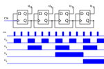

// :title: How does a CPU work? Clocks, flipflops and registers
:slug: how-does-a-cpu-work-misc
:date: 2021-12-28
:category:
:link: 
:description: 
:type: text

== Clocks, Flipflops and registers
In this blog post the author will introduce multiple elements needed at a later 
stage.

=== Register-Transfer-Level needs a clock source
As for now we only learned about combinatiorial logic, which works
without any clock source - every signal is just delayed by the 
time it needs to travel thru the circuit. This is known as asynchronous. 
But for more sophisticated tasks, sequential circuits, having registers 
storing the input and output signals are necessary 
to get correct results. This is known as synchronous.
Most, if not all designs used nowadays are synchronous, 
due to a lower design complexity.

*Register-Transfer-Level*

image:../images/how_does_cpu/rtl_scheme.svg[width="100%"]

The blue parts in the image above are showing registers where the values are 
stored, we will see later how those are implemented, lets first have a look 
at the clock source which is needed.

There are different ways to create a clock source: 

. A crystal oscillator
. A ring oscillator 

The former one is the classical, the later one a more modern variant.

[cols="a,a" width="100%"]
|===
| *crystal oscillator* | *ring oscillator*
|image:../images/how_does_cpu/crystal_symbol.svg[width="80%"]
|image:../images/how_does_cpu/inverter_chain_symbol.svg[width="80%"]
|typical frequence range: 1Mhz..100Mhz | typical frequence range: 1Hz..15Mhz(discrete layout)
|image:../images/how_does_cpu/pierce_gate_circuit.svg[width="350px"]
|image:../images/how_does_cpu/inverter_chain.svg[width="350px"]
| frequency determined by crystal geometry 
| frequency determined by propagation delay and number of gates
| accuracy mostly dependent from temperature; for precise applications crystal ovens are used
| accuracy mostly dependent from power supply stability 
|===

==== The crystal oscillator
The crystal oscilltor is a clock source based on a quartz crystal.
The frequency is dependent on the geometry of the quartz.
Crystal oscillators are available in a metal box housing, with 
additional wiring, with the quartz being the heart of the circuit. 
The circuit is commonly based on the https://en.wikipedia.org/wiki/Pierce_oscillator[Pierce oscillator].

image:../images/how_does_cpu/pierce_gate_circuit.svg[width="400px"]

Their accuracy is mostly dependent on the temperature,so for applications with high accuracy needs, 
they are housed in a quartz oven, holding the quartz on a constant temperature.
An interesting teardown of such an oscillator is available on http://www.righto.com/2021/02/teardown-of-quartz-crystal-oscillator.html[Ken Shirriffs blog].

==== The ring oscillator
Another common source of a clock source is the ring oscillator.
The trick here is to chain an odd number of inverter gates and feedback the output of the last inverter as input 
to the first inverter. This way we create an oscillating circuit. 

image:../images/how_does_cpu/inverter_chain.svg[width="400px"]

The frequency is dependent on the number of inverters as well as the propagation time Tp (see the equation below). The time the signal needs to travel 
trough the gate is known as propagation time Tp.

["latex", "../images/how_does_cpu/ring_oscillator_frequency.svg",imgfmt="svg", width="40%"] 
\[f_{ro}  = \frac{1}{2nT_{p}}\]

Here the accuracy is mostly dependent on the stability of the power supply.
An example where it is used - e.g. the 8087, intels(R) Floating Point Unit - is again provided by
http://www.righto.com/2018/08/inside-die-of-intels-8087-coprocessor.html[Ken Shirriffs blog].
As shown there, the frequency can be decreased by adding an RC-network between the inverters.

==== The classic RS-flipflop

The classic flipflop consists of two Nand gates which outputs are feedback'ed to the complementary 
gate, as can be seen in the table below. Below the circuit the truth table is given.
As can be seen the flipflop locks the output to one state, '1' or '0'. 
If both inputs are set low, the output is undefined (and conforms to the preferred position).

[cols="a,a" width="100%"]
|===
| *RS-flipflop structure* | *RS-flipflop symbol*
|
|image:../images/how_does_cpu/flipflop_symbol.svg[width="80%"]
|===

[width="50%"]
|===
|&#773;R | &#773;S || Q | &#773;Q | comments
| 0  | 0  || 1 | 1 | invalid
| 0  | 1  || 1 | 0 | Reset
| 1  | 0  || 0 | 1 | Set
| 1  | 1  || Q | &#773;Q | --
|===
One application of the classic RS-flipflop is to debounce switches.

But for most applications a more evolved flipflop is necessary. Let's have
a look at the (D)ata-flipflop.

==== The D-flipflop

In the D-flipflop the circuit of the RS-flipflop is preceeded by two Nand gates,
controlled by a clock impulse. Only when the clock is high (i.e. '1') the date applied
to the (D)ata-input is valid and stored in the RS-fliplop. Otherwise the applied data 
input is invalid.

[cols="a,a" width="100%"]
|===
| *D-flipflop structure* | *D-flipflop symbol*
|
|image:../images/how_does_cpu/dflipflop_symbol.svg[width="80%"]
|===

[width="50%"]
|===
|Clock   | D | Q | &#773;Q | comments
| 🠓 >>0  | x  | Q | &#773;Q | no change
| 🠓 >>0  | 1  | 1 | 0 | Reset
| 🠑 >>1  | 0  | 0 | 1 | Set
| 🠑 >>1   | 1  | Q | &#773;Q | -
|===

=== A binary counter

Using the D-flipflop we got acquainted with in the last section,
we can construct an (asynchronous) binary counter.
This output can be used as adresses for a ROM table, as we will see in another blog post.

[cols="a" width="100%"]
|===
| *Asynchronous binary counter with D-flipflops* 
|
|===

Using the outputs independent, it can be seen that the counter 
also works as frequency divider: On every output the frequency
is divided by two referenced to the previous one.

== Registers
What are registers? Registers are used to hold respectively store values.
Every slighlty more complex nowadays CPU has copious quantities of registers inside.
Register sizes vary widely dependent on the application. Reaching from status registers 
only holding one bit to registers over 32 and 64 bit for regular registers until vector 
registers with a size of 64 bytes (= 512 bits). Those registers are named after a certain
scheme, in some architectures with numbers (e.g. MIPS and ARM), other times with a more
comnplex scheme of alphabetic numbers (like in x86 architectures).

In the previous sections we have learned about the flipflop.
These are the building blocks of registers. As can be seen in the picture
above every flipflop is clocked by the same signal.
We will also often use the term accumulator.
Accumulators are registers which are source and destination registers
at the same time. So e.g. on addition they store one input value and
after the operation, holding the result in the same register.

