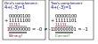

== Extending the binary system

While in the previous blog post about addition,
the binary numbers had only one interpretation,
we extend the system here to include negative (integer)
numbers.

image:../images/how_does_cpu/binary_system.svg[width="50%"]

The simplest approach we can think of is to use the most significant bit (MSB)
as sign bit, where '0' ist intepreted as sign '+' and '1' is interpreted as '-'.
However as we see in the following calculation this does not work as expected:

image:../images/how_does_cpu/addition_extended.svg[width="50%"]

=== One complement

As the previous approach does not fullfill the requirements let us introduce
the one complement and two complement here.
The one complement is just an inversion of every bit, independent from its significance.

["latex","../images/one-complement.svg",imgfmt="svg", width="70%"]
\[ 
\begin{array}{l}
00000011_{2} = +3_{10} \\
11111100_{2} = -3_{10}
\end{array}
\]

=== Two complement

However,as can be seen in the panel below, there is still a mismatch
on addition. So, as a second step the inverted number is incremented by one.
This leads us to the so-called two's complement as seen below.

["latex","../images/two-complement.svg",imgfmt="svg", width="70%"]
\[ 
\begin{array}{l}
00000011_{2} = +3_{10} \\
11111101_{2} = -3_{10}
\end{array}
\]

As can be seen in the following calculations, with the two's complement
we get the correct results.

=== Overflow 
As can be seen, in both cases, for one- and two-complement
an arithmetic overflow is produced. 
It is very dependent on the cpu achitecture how those are handled,
but in every case you get the information as a flag (v) .

=== Implementation of subtraction in a fulladder

To extend the full-adder with the logic for subtraction we do not 
need to design from scratch all again. The properties of the xor-gate
allows the first step of the two's complement, the inversion of every bit,
while for the second step the increment, we simply use '1' of the subtraction
switch as carry-input for the first full-adder stage.

=== Overview table for the number range -7..+7
 
|==============================================================
| decimal |binary | one complement | two complement
| +7 |    0111|     0111  | 0111                  
| +6 |    0110|     0110  | 0110
| +5 |    0101|     0101  | 0101
| +4 |    0100|     0100  | 0100
| +3 |    0011|     0011  | 0011
| +2 |    0010|     0010  | 0010
| +1 |    0001|     0001  | 0001
| +0 |    0000|     0000  | 0000      
| -0 |    1000|     1111  | -
| -1 |    1001|     1110  | 1111
| -2 |    1010|     1101  | 1110
| -3 |    1011|     1100  | 1101
| -4 |    1100|     1011  | 1100       
| -5 |    1101|     1010  | 1011
| -6 |    1110|     1001  | 1010
| -7 |    1111|     1000  | 1001
|==============================================================

// 

