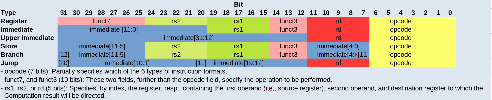

:title: How does a CPU work? A RISC-V Processor
:slug: how-does-a-cpu-work-riscv
:date: 2022-03-21
:tags: draft
:category:
:link:
:description:
:type: text

== Digital design meets computer architecture

= RISC vs CISC and The RISC-V architecture 

Existing processor types can be classified by their instruction type set:
Reduced instruction set computer (RISC), Complex instruction set computer (CISC) and hybrid forms.
While mini processors like ARM for embedded systems mostly utilise reduced instruction
sets,todays workstation and Server Architectures (x86, x86_64) are hybrids of RISC and CISC.
The idea of a reduced instruction set is to avoid big complex instructions and multiple different
addressing modes (as those typically used in x86 architectures).
Advantages of a RISC architecture are shorter pipelines which allows faster clocking.
RISC architectures follow a simple scheme: 'Fetch -> Decode -> Fetch Operands -> Execute -> Write Back'
Also instructions have a constant length, memory operations are divided from arithmetic operations,
which is known as Load/Store-architecture. RISC-V is an open standard for the instruction set archtitecture (ISA).
Most of this post is referenced from the popular book Computer Organization and Design (RISC-V) Edition by Hennessey and Patterson.
    
== RISC-V Assembler

Here we introduce the RISC-V assembler.
The subset shown here is a bit bigger than the one we will implement further down the line.
For example also immediate instructions like 'addi' are shown, necessay as a way to load constants
into registers. The example program shown below, counts from 0 to 10, utilizing a loop.

----
ADDI x2, x0, 1
ADDI x3, x0, 10

loop:
   ADD x1, x1, x2
   SW  x1, 4(x0) 
   BNE x3, x1, loop
   HLT

----
Register-type: Instruction [dest. reg] [reg1] [reg2]

Load / Store-type:  Instruction [dest. reg] [byte offset(reg1)] *

Branch-type: Instruction [dest. reg] [reg1] [dest. label]

For the load / store instructions the reg1 contains the start address while the byte offset
contains the size of the value loaded into the register (normaly 4) / respectively written to
the memory.

An overview of the instruction formats of the different types is given below:

== A minimal Implementation
The minimal working subset of a RISC-V implementation contains the following instructions:

* Arithmetic-logical instructions 'add', 'sub', 'and' and 'or' [Register-type instructions]

* Memory reference instructions like load word (lw) and store word (sw)  [Store-type instructions]

* Conditional branch instruction(s) like branch-if-equal (beq) [Branch-type instructions]

We will see how the instruction set architecture choosen, affects performance-related key aspects like
clock rate and Cycles-per-instruction (CPI).
We will also see, that the different instruction types only differ in the later stages of the Fetch->Decode-> Execute-cycle

For every instruction the first two steps are identical:

    1. The program counter (PC) points to the  current code that will be executed.The address is sent to the memory to fetch the current instruction from the memory.
       
    2. Read two (one for the lw-instruction) registers, the instruction fields contains the register numbers.

For the next steps the actions depend on the instruction type, but are still utilizing / sharing the same resources.
For example the ALU is used by Register-type instruction to compute data, while it is also used by Store-type instructions
to compute the address, and the Branch-instructions for the equality test.
Only after that ALU, the different instruction types really differ.

As we will see the abstract schematic shown below does not explain all cases. 
We need another schematic extended, showing also the control parts.
    
image:../images/how_does_cpu/cpu_structure_with_control.svg[width="120%"]

== The Fetch-Decode-Execute cycle for the different instruction types

We will start with the common Fetch-Decode-Execute cycle of a common RISC processor,
and demonstrate the working principle of it for typical instructions.

The full cycle is: Fetch -> Decode -> Fetch Operands -> Execute -> Write Back

[options="header"]
|==================
| Type | example instruction| Fetch | Decode | Fetch Operands | Execute | Write Back
| Register |add, sub,and,or | fetch instruction, increase PC by 4 | Decode instruction | Fetch operands from registers | Execute calculation in ALU | Write value back to data memory.
| Store | lw,sw | fetch instruction, increase PC by 4 | Decode instruction | operand | Calculate address | read / write data from / to memory
| Branch |beq | fetch instruction,set PC to destination address | Decode instruction | Fetch operands from registers |Test for equality (for beq)  | switch multiplexer for address calculation to second adder
|==================

=== The instruction part
To explain a cpu on this abstract level, we need to introduce some more concepts,
e.g that an **instruction**, stored in memory, is accessible under a specific address.
An **address** in RISC-V standards is a 32 bit long value, pointing to  a certain cell in a memory array.
The **program counter (PC)** is a register which points to a certain address in the memory / register file. The program counter is connected to the first address-adder with a contant intger of 4 (the adress offset, 4 * 1 byte = 32 bit). 

image:../images/how_does_cpu/cpu_instruction_part.svg[width="120%"]

If the instruction in the memory is an address modifying instruction,
the given value will be added by the second address-adder. 
This way we can generate **jump** instructions. 

image:../images/how_does_cpu/cpu_instruction_path.svg[width="120%"]

=== The data path 

The data path shows some elements we already are familiar with - the ALU - as well as elments
we are not yet familiar with - the memory blocks - on the right the so-called register file 
and on the left the data memory. Both inputs of the ALU are connected to one (different) register.

image:../images/how_does_cpu/cpu_data_path.svg[width="120%"]

=== The control part

The control part is the most black-boxed element we see. We know already how the multiplexers work, 
and we see already a feedback line for the branch control. But most of the elements in this abstract view
remain unknown to the reader. Let us change this by having a closer look into it.

image:../images/how_does_cpu/cpu_structure_with_control.svg[width="120%"]
