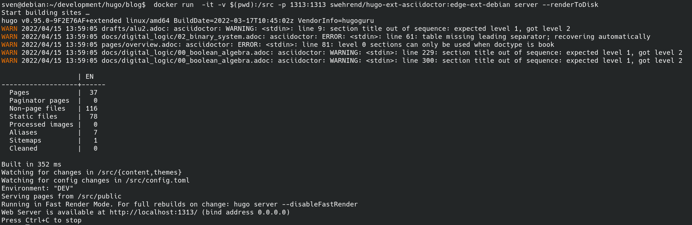
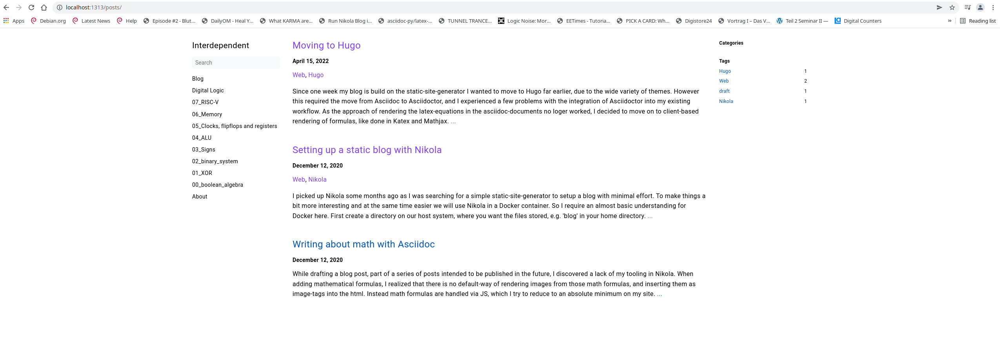

Since one week my blog is build on the static-site-generator https://gohugo.io/[Hugo].
I wanted to move to Hugo far earlier, due to the wide variety of themes.
However this required the move from Asciidoc to https://asciidoctor.org/[Asciidoctor],
and I experienced a few problems with the integration of Asciidoctor into my existing workflow. 
As the approach of rendering the latex-equations in the asciidoc-documents
no loger worked, I decided to move on to client-based rendering of formulas,
like done in https://gohugo.io/Katex[KaTex] and https://www.mathjax.org/[Mathjax].

So to install Hugo, Asciidoctor and its dependencies without headaches,
we again make use of Docker and its huge ecosystem: Sombody already created Docker images for hugo with asciidoctor integrated,
so we do not need to go thru the sometimes cumbersome setup of Asciidoctor and its dependencies.

With docker installed, in the shell (for Linux and Mac OS, for Windows the powershell) we do a

----
docker pull klakegg/hugo:edge-asciidoctor
----

which pulls an image with the latest Hugo version and Asciidoctor integrated from the Docker-repo klakegg .

We navigate to the parent-directory of our blog, and run the following command:

----
docker run  -it -v $(pwd):/src klakegg/hugo:edge-asciidoctor new site hugo/blog
----

This creates the skeleton of our new site, looking like that:

----
old-blog
hugo
 └── blog
    ├── archetypes
    ├── config.toml
    ├── content
    ├── data
    ├── layouts
    ├── static
    └── themes
----

We have no theme installed yet, so go to https://themes.gohugo.io/[themes] and select your favorite,
mine is https://themes.gohugo.io/themes/hugo-book/[Book]. We install it via simple download or via git 

----
cd hugo/themes
git clone https://github.com/alex-shpak/hugo-book
----

and add the line 
----
theme = "hugo-book"
----
to our config.toml. While we are at it we also add the following policy, necessary since hugo version 0.91, to our config.
____
[security]
  enableInlineShortcodes = false
  [security.exec]
    allow = ['^dart-sass-embedded$', '^go$', '^npx$', '^postcss$', '^asciidoctor$']
    osEnv = ['(?i)^(PATH|PATHEXT|APPDATA|TMP|TEMP|TERM)$']
____

Now we need to move the content from the old blog to new, we do something similar to this
----
cp ../old_blog/pages ../hugo/content/docs
cp ../old_blog/posts ../hugo/content/posts
cp ../old_blog/images ../hugo/content/docs/images 
----

Now we need to convert the adoc-headers to the hugo frontmatter format,and also adapt the 
asciidoc syntax to the new.
To make our new blog digesting the equations and formulas written in Latex, we need to add the script for KaTex / Mathjax at some 
layout-file in the theme of our choice: https://katex.org/docs/browser.html[Integrate KaTex]

To see what we need to change we execue the hugo-server and in the browser head over to the given address
http://localhost:1313

----
docker run  -it -v $(pwd):/src -p 1313:1313 swehrend/hugo-ext-asciidoctor:edge-ext-debian server --renderToDisk
----
which results in something similar to this:

If we are satisfied with the result we can deploy our site with an rsync to our webspace, something similar
to the following command:

----
rsync -rav public/ wehrend@giclas.uberspace.de:/var/www/virtual/wehrend/html
----

