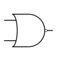
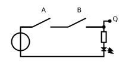
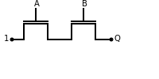
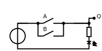
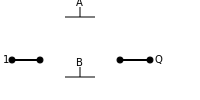

.. title: How does a CPU work? Boolean algebra
.. slug: how-does-a-cpu-work-boolean-algebra
.. date: 2012-12-23
...tags: draft
.. category: 
.. link: 
.. description: 
.. type: text

= Boolean Algebra and Basic Logic Gates

We are starting (the journey) with three very 
simple basic blocks, however, despite its simplicity 
already are valid instructions of a (hypothetical) CPU:

*AND, OR and NOT*

The truth tables of every function is given below for a number of two inputs,
respectively one for the inverter.

=== AND

The and  operation  also termed as conjunction 
is denoted as A ∧ B = Q

[width="50%"]
|================
| A   | B   |  Q  
| 0   | 0   |  0  
| 0   | 1   |  0  
| 1   | 0   |  0  
| 1   | 1   |  1  
|================

=== OR 

The or operation also termed as disjunction 
is denoted as A v B = Q

[width="50%"]
|================
| A   | B   |  Q  
| 0   | 0   |  0  
| 0   | 1   |  1 
| 1   | 0   |  1  
| 1   | 1   |  1  
|================
  

=== NOT 
The not operation also termed as inversion,
is denoted as [overline]#A# = &not; A = Q

[width="50%"]
|==========
| A   | Q    
| 0   | 1    
| 1   | 0    
|=========

Accordingly the gate-level implementation is also known by the name inverter.
Despite its seemingly simple funationality there is a lot to say about the inverter 
for both the logical as well the implementation, so the author will dedicate it an own 
post in the mid-feature.

//A whole own post can be filled with this topic, and we will probably also do so 
//in the middle future.

'''

Although boolean algebra on itself is an interesting field, we will only skim the subject briefly here, just enough
to get a feeling and understanding how to work with boolean formulas.

[NOTE]
If you are interested in a more profound view, providing induction and proof, 
I refer you to accordingly literature (sources listed at the end).

The laws of the boolean algebra are shown in the following table:
[width="100%",cols="4^,100a,100a",options="header"]
|====================================================================================================================
|      |  ∧  (conjunction, AND operator)               |  ∨ (disjunction, OR operator)
| commutative law   | 
["latex", "../images/commut_A.svg",imgfmt="svg"] 
$p \land q = q \land p                                                    $   |
["latex", "../images/commut_V.svg",imgfmt="svg"] 
$p \lor q = q \lor p                                                      $  
| associative law   | 
["latex", "../images/assoc_A.svg",imgfmt="svg"] 
$p \land (q \land r) = (p \land q) \land r = pqr                $  |
["latex", "../images/assoc_V.svg",imgfmt="svg"] 
$p \lor (q \lor r) = (p \lor q) \lor r = p \lor q \lor r        $
| absorptions law   | 
["latex", "../images/absorp_A.svg",imgfmt="svg"] 
$p \land (p \lor q) = p                                         $
| 
["latex", "../images/absorp_V.svg",imgfmt="svg"] 
$p \lor (p \land q) = p                                         $
| distributive law  | 
["latex", "../images/distrib_A.svg",imgfmt="svg"] 
$p \lor (q \lor r) = (p \land q) \lor (p \land r) = pq \lor pr  $ |
["latex", "../images/distrib_V.svg",imgfmt="svg"]
$p \lor (q \lor r) = (p \lor q) \lor (p \lor r) = (p \lor q)(p \lor r)$
| neutral elements  |
["latex", "../images/neutral_A.svg",imgfmt="svg"]
$p \land 1 = p                                                  $ | 
["latex", "../images/neutral_V.svg",imgfmt="svg"]
$p \lor 0 = p                                                   $
| complem. element  | 
["latex", "../images/comp_A.svg",imgfmt="svg"]
$p \land \neg p = 0                                             $ |
["latex", "../images/comp_V.svg",imgfmt="svg"]
$p \lor \neg p = 1                                              $                                      
4+|    Source:  Hans-Jochen Bartsch, Taschenbuch Mathematischer Formeln, 20. Auflage, p. 27- 28  |
|====================================================================================================================

You probably know intuitively - or from school-  the first two laws mentioned in the table, 
the commutative law and the associative laws.
As you can see, every law can be applied to conjunctions as well as disjunctions without any exceptions.

The commutative law implies that the order of the variables is neutral for the operation and can be swapped without
changing the result of the operation. 

The associative law implies, that parenthesis are swappable. Conjunctions can be condensed without operator.

The absorptions law is probably not known to you from school, as it is only used in logic and has no counterpart in at least
school mathmatics.

The distributive law, again, is known from school. It implies that variables / operations outside of paranthesis needs 
to be applied to all variables in the parenthesis.

The law of neutral elements, again is something special to boolean algebra. The logic one is the correspondent to 'true',
and so p and true equals 'true', so as the logic zero is 'false' and so p or false equals p.

The complementary law implies, that to every element (variable) p there is a complementary element (variable) [overline]#p#,
so that the conjunction results in a  logical zero while disjunction results in a logical one.

'''

At this point the author has to leap ahead a bit as some practical issues on the electrical level need some thought on their
logic level:
On the implementation level (for an electrical implementation) it is rather uncommon to use AND,OR and NOT directly, instead 
the inverse functions NAND and NOR are used.

=== NAND and NOR

The NAND gate is denoted as [overline]#A ∧ B# = Q

[width="50%"]
|==================
| A   | B   |  Q  
| 0   | 0   |  1  
| 0   | 1   |  1  
| 1   | 0   |  1  
| 1   | 1   |  0  
|==================

image:../images/how_does_cpu/nand_gate.svg[width=200]

while the NOR gate is denoted as [overline]#A v B# = Q

[width="50%"]
|==================
| A   | B   |  Q  
| 0   | 0   |  1  
| 0   | 1   |  0  
| 1   | 0   |  0  
| 1   | 1   |  0  
|==================

As you can see, for those two functions the results are exactly the inverse of their respective complement 
(NAND <==> AND,NOR <==> OR). 

== The De Morgan theorem

In addition to those merely basic axioms introduced above, there is the **De Morgan theorem**,
which we need to easily convert between NAND and NOR. For the sake of simplicity we only show for 
two elements however the theorem is independent from any number of elements / inputs.

["latex", "../images/demorgan_nand.svg",imgfmt="svg"] 
$\overline{p_1 \land p_2} = \overline{p_1} \lor \overline{p_2}$

[width="75%"]
|==========================================================================================
| A   | B   |[overline]#A# | [overline]#B# |  [overline]#AB# | [overline]#A# v [overline]#B#
| 0   | 0   |    1         |     1         |          1       | 1
| 0   | 1   |    1         |     0         |          1       | 1
| 1   | 0   |    0         |     1         |          1       | 1
| 1   | 1   |    0         |     0         |          0       | 0
|===========================================================================================

image:../images/how_does_cpu/de_morgan_nand_equivalence.svg[width=400]

["latex", "../images/demorgan_nor.svg",imgfmt="svg"] 
$\overline{p_1 \lor p_2} = \overline{p_1} \land \overline{p_2}$

[width="75%"]
|==========================================================================================
| A   | B   |[overline]#A# | [overline]#B# |  [overline]#AvB# | [overline]#A# [overline]#B#
| 0   | 0   |    1         |     1         |          1       | 1
| 0   | 1   |    1         |     0         |          0       | 0
| 1   | 0   |    0         |     1         |          0       | 0
| 1   | 1   |    0         |     0         |          0       | 0
|===========================================================================================

image:../images/how_does_cpu/de_morgan_nor_equivalence.svg[width=400]

Now we are finally equipped to continue with the electrical part / description.

== Implementation on electrical level 

[width="100%" cols="a^,a^"]
|======
| wire schematic | pass transistor logic 
|  |  
| symbolic schematic | real implementation (varying)
|  ^| [big]#?#
|======

[width="100%" cols="a^,a^"]
|======
| wire schematic | pass transistor logic
|  | 
| symbolic schematic | real implementation (varying)
| ^| [big]#?#
|======

