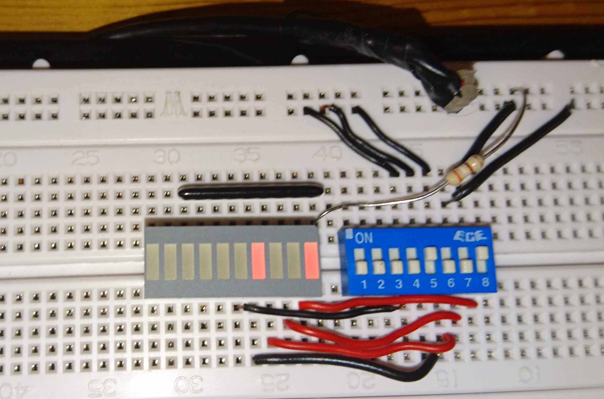
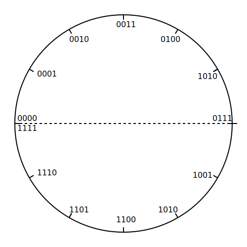

.. title: How does a CPU work?
.. slug: how-does-a-cpu-work
.. date: 2021-11-23
// .. tags: draft
.. category:
.. link:
.. description:
.. type: text

==  The Binary System

All computer we act with on a daily base do not know about the decimal system we are using, based on the ten digits at our hands.
All they know about are the states `on` and `off`. We build an imaginary circuit with a power source a control light - here an LED (Light Emitting Diode)  - and a switch,
closing the connection let the light flash. An off light counts as zero, and on light counts as one. Simple as it.We switch the light on
and get a one.

image:../images/how_does_cpu/lights.png[title="A schematic of the imaginary circuit."]

Now we extend this installation with a second light and switch left to current one. We switch the left light on and the right on. What we get as a result is a '2'.
Switching the right light on again gets us to 3. Like in our decimal system, the significance of the left light is higher (at least in our example), only the factor differs,
instead of 10 the factor is 2. We denote the significance with 2^n where n is the position of the light. Every switch is a bit - more exactly the switch is the input and the
LED is the output. So with four switches -half a byte - we can count from 0 to 15, while with eight switches - a byte - we can count from 0 to 255. This scheme can be extended as needed.

|==============================================================
| Binary  | Hex |unsigned Interpretation |One complement|Two complement
|     0000| 00  |  0            |   0          | 0            
|     0001| 01  |  1            |   1          | 1            
|     0010| 02  |  2            |   2          | 2            
|     0011| 03  |  3            |   3          | 3            
|     0100| 04  |  4            |   4          | 4            
|     0101| 05  |  5            |   5          | 5            
|     0110| 06  |  6            |   6          | 6            
|     0111| 07  |  7            |   7          | 7            
|     1000| 08  |  8            |   -7         |-8            
|     1001| 09  |  9            |   -6         |-7            
|     1010| 0A  |  10           |   -5         |-6            
|     1011| 0B  |  11           |   -4         |-5            
|     1100| 0C  |  12           |   -3         |-4            
|     1101| 0D  |  13           |   -2         |-3            
|     1110| 0E  |  14           |   -1         |-2            
|     1111| 0F  |  15           |   -0         |-1            
|==============================================================

== A simple Ripple-Carry adder

Let us do some simple calculations with the goal to derive the necessary logic for an adder-unit.
The addition is done like learned in elementary school, just that this time we add binary numbers.
The first example works while the second one producesa carry flag besides the (wrong) result.

image:../images/how_does_cpu/addition.svg[width="100%"]

= Scheme for combinatorial circuit
We develop the RC-adder circuit according to the following scheme, 
applied to evaluate combinatorial circuits

. Define inputs and outputs 
. Construct truth table 
. Evaluate boolean equations / simplify 
. Draw optimized combinatorial circuit 

[cols="a,a",options="header"]
|===
Truth table for fulladder cell | fulladder cell |
||
[width="100%",cols="3,3,3,0,3,3",options="header"]
!===
! c_in ! A ! B !! c_out ! sum
! 0 ! 0 ! 0 !! 0 ! 0
! 0 ! 0 ! 1 !! 0 ! 1
! 0 ! 1 ! 0 !! 0 ! 1
! 0 ! 1 ! 1 !! 1 ! 0
! 1 ! 0 ! 0 !! 0 ! 1
! 1 ! 0 ! 1 !! 1 ! 0
! 1 ! 1 ! 0 !! 1 ! 0
! 1 ! 1 ! 1 !! 1 ! 1
!===
| 
|===

["latex","../images/sum-equations.svg",imgfmt="svg", width="100%"]
\Large
\[
\begin{aligned}
s & = (\overline{c_{in}} \land \overline{A} \land B) \lor (\overline{c_{in}} \land A \land {\overline{B}}) \lor (c_{in} \land \overline{A} \land \overline{B}) \lor (c_{in} \land A \land B) \\
& = \overline{c_{in}}(\overline{A} \land \overline{B) \lor (A \land \overline{B}) \lor c_{in}((\overline{A} \land \overline{B}) \lor (A \land B)) \\
& = \overline{c_{in}}(A \oplus B) \lor c_{in}(\overline{A \oplus B}) \\
& = A \oplus B \oplus c_{in}
\end{aligned}
\]

["latex","../images/carry-equations.svg",imgfmt="svg", width="100%"]
\Large
\[
\begin{aligned}
c_{out} & = \overline{c_{in}}(A \land B) \lor c_{in}(\overline{A} \land B) \lor c_{in}(A \land \overline{B}) \lor c_{in}(A \land B) \\
& = \overline{c_{in}}(\overline{A} \land \overline{B}) \lor (A \land \overline{B}) \lor c_{in}((\overline{A} \land \overline{B}) \lor (A \land B)) \\
& = \overline{c_{in}}(A \land B) \lor c_{in}[(\overline{A} \land B) \lor (A\land \overline{B}) \lor A \land B] \\
& = \overline{c_{in}}AB \lor c_{in}(A \oplus B) \lor c_{in}AB \\
& = (\overline{c_{in}} \lor  c_{in})AB \lor c_{in}(A\oplus B) \\
& = AB \lor c_{in}A \oplus B
\end{aligned}
\]

////
==  A simple adder

So now we know what the binary system is and how to count and add in. But if we want also to subtract we are still missing something - the knowledge how negative numbers are mapped in this system /logic.

==  One and two's complement

The figure below shows an illustration of the range of numbers on a circle.
the upper plane showing the positive interpreted numbers, the lower plane
the negative interpreted numbers.

.Unit circle with numbering

////
