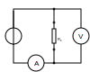

.. title: Prequel: Introduction to electronics
.. slug: prequel-short-introduction-to-electronics
.. date: 2021-01-23 22:13:55 UTC
.. tags: 
.. category: 
.. link: 
.. description: 
.. type: text

= Prequel Introduction to electronics 

'''
While I was about to write the implementation part of the boolean algebra post, the basic logic 
gates, the writing process got quickly out of hand and I caught myself to write more about less connected
topics like explaining basic electronic components and their implementation on silicon than the actual content,
here shall be the place for those excursions.

'''

== Ohm's law and lead resistance 

*Exercise: Measure Resistance* 
To execute the following exercise you need one voltagemeter and one amperemeter (or just two multimeters), a variable voltage source and
some sample wires of different materials but same in lenght and diameter.
If you do not have the equipment, in theory you could also simulate this exercise in http://qucs.sourceforge.net[Qucs] or 
https://www.analog.com/en/design-center/design-tools-and-calculators/ltspice-simulator.html[LTspice]. 

But as we need to upfront define the parameters of sample wires we want
to measure, this approach kinda torpedoes the purpose of the exercise, of learning how to do an indirect measurement of electrical
resistance.

Connect the equipment according to the figure shown below, with the sample wire as the resistor Rx. 

//.Resistance measurement principal

Now, for every wire measure the voltage and the current and plot a graph of it with voltage on x-axis and current on y-axis. 
You will see that for different materials, you get a linear graph but with a different slope. So you have find a relation 
between voltage current and resistance. In addition after measuring the different wires you can also use pen & paper: draw a line with 
a pencil or scribble a small area. Now connect these with the probes of the measurement assembly. You will see, that also
the graphit trace work as a conductor -not an optimal one but a conductor. 

This observance leads us to the most important formula you will encounter in an electrical engineering 101 course, Ohm's law.

["latex","../images/ohms_law.svg" ,imgfmt="svg"]
\large \[ R = \frac{U}{I}\]

// .Ohm's law
// :figure-caption: Equation

// Todo: write more about / to the ohms law.

So we discovered that the materials differ in their electrical conductivity - which is the reciprocal of the electrical resistance -
some are good (conductor) some are pretty bad and unusable (non-conductor) but nevertheless useful as dielectric, as we will see in
the next section and some in between. 
We also need to note, of course that the conductivity is not only dependent on the material itself but also its geometries, you know we handle
with physics, so another useful formula / equation in this context is the following.

["latex","../images/wire_resistance.svg" ,imgfmt="svg"]
\large \[ R = \frac{\rho L}{A}\]

So the total resistance of a wire or a strip conductor on a PCB is dependent upon the specific resistivity ρ, the length
of the conductor and the area used to transfer the current. Logically the specific resistivity as well as the lenght of the conductor 
increases the resistance while the area counteracts it.

Below figure shows the principial of resistance measurement applied within a digital multimeter - leaving aside the range switch.
On the left side we have a constant current source, in the middle the resistor - or wire under measurement and on the left 
a voltmeter measuring the voltage. As with the constant current source the overall current in the circuit is known, the resistance 
can be scaled from that with the voltage measured.

// .Resistance measurement applied in a digital multimer
image:../images/how_does_cpu/resistance_measurement_ll.svg[width=550]

=== The Resistor

The electrical component itself comes in all shapes and sizes dependent on the area of application.
the miniature ones for surface mounted devices technique, used in all higher integrated electronic devices, 
the average 1/4 Watt resistor based on coal with 5 percent tolerance and the more precise metal film resistors
with 1 percent tolerance. The resistors with adjustable resistance called potentiometer, the varistor where the 
resistance is dependent upon the voltage applied, some other types like NTC / PTC depending on the temperature.

== Capacitor

