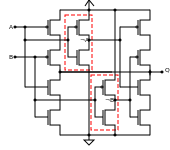

.. title: How does a CPU work? Exclusive-Or (XOR)
.. slug: how-does-a-cpu-work-xor
.. date: 2021-11-08
.. category:
.. link: 
.. description: 
.. type: text

As there are a lot of important applications for the exclusive-or (XOR) operation
it is dedicated an own blog post. Two of the most important are:

- An integral part of scrambler respectively descrambler which are an element in transmitters respective receivers
- Part of an encryption algorithmus
- Last but not least an important part of a halfadder.

////
as you can expect for a such basic and fundamental operation, but still
the situation is a bit different with this operation compared to 'and' and 'or'.
////

The exclusive-or operation xor which is also termed as antivalence
is denoted as A ⊕ B = Q. Its truth table is shown below

[width="50%"]
|================
| A   | B   |  Q  
| 0   | 0   |  0  
| 0   | 1   |  1 
| 1   | 0   |  1  
| 1   | 1   |  0  
|================
  
image:../images/how_does_cpu/xor_symbol.svg[width=200]

 

== Applications

////
