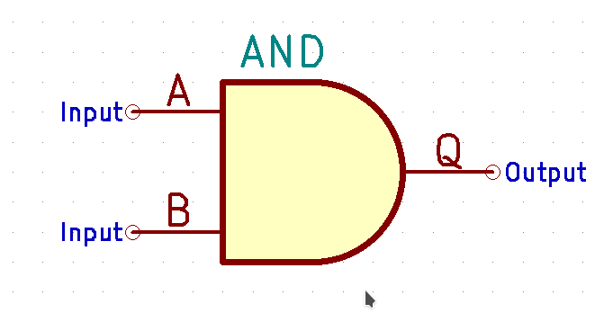
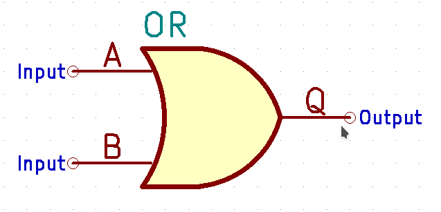
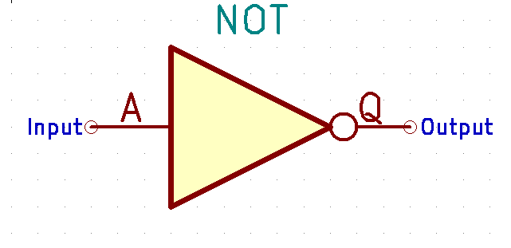

.. title: How does a CPU work? Boolean algebra
.. slug: how-does-a-cpu-work-boolean-algebra
.. date: 2020-10-18 15:00:00 UTC
.. has_math: true
.. category: 
.. link: 
.. description: 
.. type: text

== Boolean Algebra and Basic Logic Gates

We are starting (the journey) with three very 
simple basic blocks, however, despite its simplicity 
already are valid instructions of a (hypothetical) CPU:

AND, OR and NOT

The truth tables of every function is given below for a number of two inputs,
respectively one for the inverter.

= AND

The and  operation  also termed as conjunction 
is denoted as 

["latex","../images/and.svg",imgfmt="svg"]
\LARGE $A \land B = Q$

|================
| A   | B   |  Q  
| 0   | 0   |  0  
| 0   | 1   |  0  
| 1   | 0   |  0  
| 1   | 1   |  1  
|================

    

= OR 

The or operation also termed as disjunction 
is denoted as

["latex","../images/or.svg", imgfmt="svg"]
\LARGE $A \lor B = Q$

|================
| A   | B   |  Q  
| 0   | 0   |  0  
| 0   | 1   |  1 
| 1   | 0   |  1  
| 1   | 1   |  1  
|================

  
NOT (Inverter)
--------------
The not operation also termed as inversion 
is denoted as 

["latex","../images/not.svg",imgfmt="svg"]
\LARGE $\overline{A}=\neg A = Q$

|=========
| A   | Q    
| 0   | 1    
| 1   | 0    
|=========

        
Although boolean algebra on itself is an interesting field, we will only touch the subject briefly here, just enough
to get to the practical side of it. If you are intersted in a more profound view, providing induction and proof, I refer you to accordingly
literature (sources listed at the end).

The laws of the boolean algebra are shown in the following table:
[width="100%",cols="^2,^4,20,20",options="header"]
|====================================================================================================================
|  |                   |  ∧                                         |  ∨                                             
| 1| commutative law   | p ∧ q = q ∧ p                             | p ∨ q = q ∨ p                                   
| 2| associative law   | p ∧ (q ∧ r) = (p ∧ q) ∧ r = pqr           | p ∨ (q ∨ r) = (p ∨ q) ∨ r = p ∨ q ∨ r           
| 3| absorptions law   | p ∧ (p ∨ q) = p                           | p ∨ (p ∧ q) = p                                 
| 4| distributive law  | p ∨ (q ∨ r) = (p ∧ q) ∨ (p ∧ r) = pq ∨ pr | p ∨ (q ∨ r) = (p ∨ q) ∨ (p ∨ r) = (p ∨ q)(p ∨ r)
| 5| neutral elements  | p ∧ 1 = p                                 | p ∨ 0 = p                                       
| 6| complem. element  | p ∧ ¬p = 0                                | p ∨ ¬p = 1                                      
| Source:  Hans-Jochen Bartsch, Taschenbuch Mathematischer Formeln, 20. Auflage, p. 27- 28                           
|====================================================================================================================

= Implementation on electrical level 

On the implementation level (for an electrical implementation) it is rather uncommon to use OR, AND, and NOT directly,
we will discuss the why at the end of this post. But first let me introduce the NAND and NOR gates

= NAND and NOR

The NAND gate is denoted as 

["latex", "../images/nand.svg",imgfmt="svg"]
\LARGE $\overline{A \land B} = Q$.

|==================
| A   | B   |  Q  
| 0   | 0   |  1  
| 0   | 1   |  1  
| 1   | 0   |  1  
| 1   | 1   |  0  
|==================

while the NOR gate is denoted as 

["latex","../images/nor.svg",imgfmt="svg"]
\LARGE $\overline{A \lor B} = Q$ .

|==================
| A   | B   |  Q  
| 0   | 0   |  1  
| 0   | 1   |  0  
| 1   | 0   |  0  
| 1   | 1   |  0  
|==================

As you can see, for those two gates the results are exactly the inverse of their respective 'partner'. 

Gates of these types can be conversed to 

.. In addition to those merely basic axioms, there is the **De Morgan theorem**
.. 
.. The De Morgan theorm is heavily used to converse logic between NAND and NOR.
.. As we will see in the next section, on the implementation level often NAND and NOR gates are used instead 
.. of the basic gates described before, due to easier realisation.

