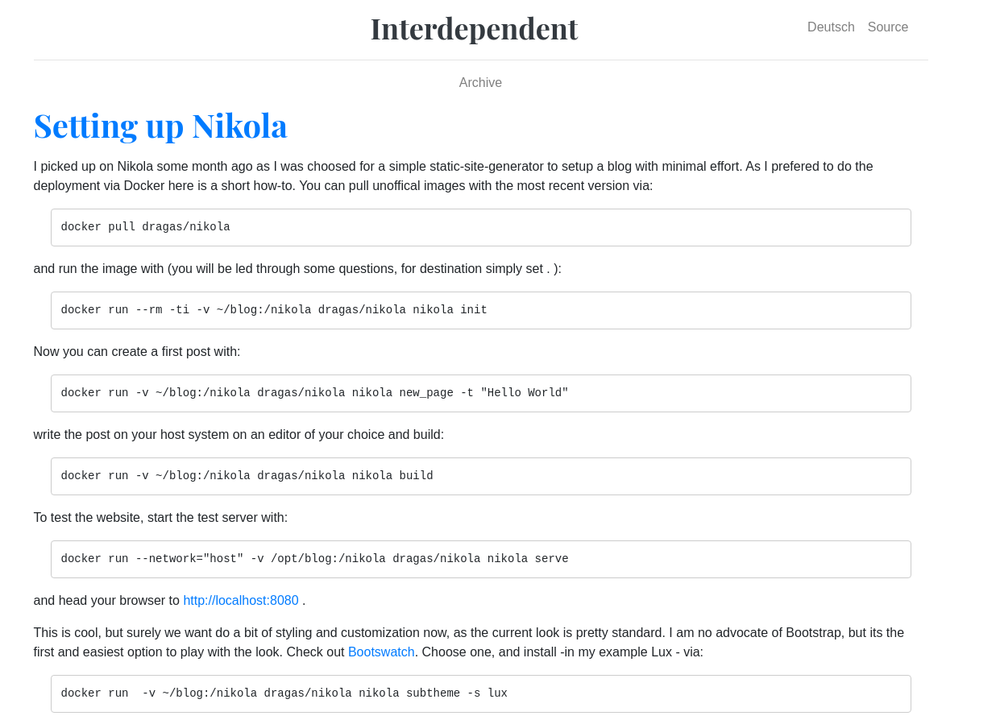

.. title: Setting up a static Blog with Nikola
.. slug: setting-up-a-static-blog-with-nikola
.. date: 2020-12-12
.. tags: Web, Nikola
.. category:
.. link:
.. description: How to setup Nikola (on Docker)
.. type: text

I picked up Nikola some months ago as I was searching for a simple static-site-generator to setup a blog with minimal effort.

To make things a bit more interesting and at the same time easier we will use Nikola in a Docker container.
So I require an almost basic understanding for Docker here.

First create a directory on our host system, where you want the files stored, e.g. 'blog' in your home directory.

You can pull unoffical images with the most recent version via:

 docker pull dragas/nikola

and run the image getting a (bash) shell via:

 docker run -it --network="host" -v ~/blog:/nikola dragas/nikola

here the option flag -it stands for interactive - which it does not but it is easy to memorize so, so let it be so.
Furthermore we need to add our volume, a storage resource which is shared between the host system and the docker container. So we add
-v ~/blog for our blog located in our home directory (for linux, on windows systems the paths differ).
Also we need to add the option --network="host" otherwise we won't be able to access the webpage from our host system, and thus from our browser.
If you are interested, check ++https://docs.docker.com/engine/reference/run/++[Docker run]

Here you can execute the common bash commands like cd, ls, ps and so on, feel free to test and explore
++https://dev.to/awwsmm/101-bash-commands-and-tips-for-beginners-to-experts-30je++[Basic bash commands] :-)

Now that you have explored the system a bit, you can initiate a basic nikola project via:

 nikola init

You will be led through some questions regarding your blog, for destination simply set .

We create a first post with:

 nikola new_page -t "Hello World"

Write the post on your host system on an editor of your choice it is located in blog/posts/hello-world.rst and then build via:

 nikola build

To test the website, start the test server with:

 nikola serve

and head your browser to http://localhost:8080[http://localhost:8080] .

This is cool, but surely we want do a bit of styling and customization now, as the current look is pretty standard.
The author's preference is a plain and simple style without much unnecessary payload.So I searched for such theme, but they were not
to my liking. Then I found the ++https://themes.getnikola.com/v8/hyde/++[Nikola port of Hyde]

The theme can be installed with:

 nikola theme -i hyde

After installation the theme needed some tweaking of the about section in the sidebar. So the version shown here diverges
from the original look. Adjustments were made to the file assets/css/hyde.css in the directory of the freshly installed theme.
Ideally the changes should be made in an additional file custom.css

image:../images/nikola_hyde.png[Unnamed image]

Much better now!

If we are satified with the result, we can deploy our new static site to web space of our choice. For this we adjust the deploy setting 
in th conf.py file. This can look like the following.

[source,python]
....

DEPLOY_COMMANDS = {
    'default': [
        'rsync -rav --delete output/ <user>@<server>:/var/www/virtual/<user>/html',
        'rdiff-backup output ~/blog-backup',
    ]
}
....

Now, we can simply execute this command by typing

 nikola deploy

and the new site is part of the www.
